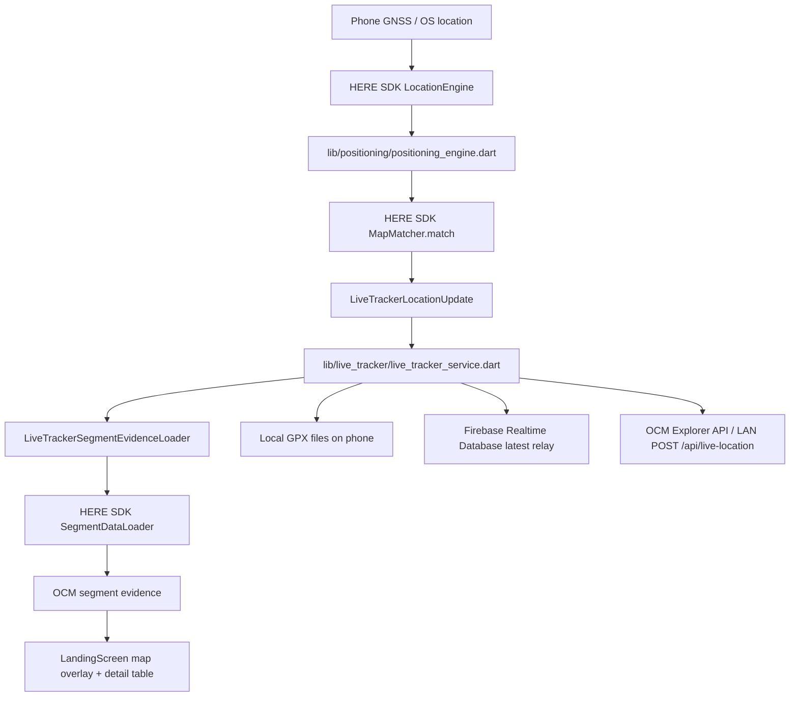

# OCM Explorer Companion

[Traditional Chinese README](./README_TW.md)

OCM Explorer Companion is a Flutter mobile app extended from the HERE SDK Reference Application for Flutter. It keeps the original reference app features for maps, search, routing, navigation, and offline maps, and adds the live tracking, map matching, OCM segment evidence, GPX recording, and remote location relay features needed by OCM Explorer.

This README is intended to:

- Help Flutter beginners build the app step by step and install it on their own Android phone or iPhone.
- Help OCM / HERE SDK users understand the app features, data flow, and architecture boundaries.

## Feature Overview

This app is the mobile companion tool for OCM Explorer. Its main purpose is to collect the current phone location, run HERE SDK map matching, query the corresponding OCM segment attributes, and optionally send the current location to another OCM Explorer client.

Current features:

- HERE map display with day / night mode switching.
- Search, route planning, turn-by-turn navigation, and offline map features inherited from the HERE reference app.
- Live location from the HERE SDK `LocationEngine` on the phone.
- On-device map matching through HERE SDK `MapMatcher.match()`.
- OCM segment evidence from HERE SDK `SegmentDataLoader`.
- Prominent matched segment display on the map, including glow, outline, start node, end node, and driving direction arrows.
- Structured OCM Segment panel shown as tables.
- OCM segment details can be exported / shared as CSV.
- Firebase Realtime Database relay for latest current location.
- LAN HTTP API relay when Firebase cannot be used or cloud relay is not needed.
- Local GPX track recording on the phone, with one GPX track per session by default.
- GPX repair / append to reduce the chance of manually repairing files after app crashes or system termination.
- Privacy notice appears on first launch only. After acceptance, it will not appear on every launch unless app data is cleared.

## Important Data Boundary

Firebase is used only as a current-location relay in this app. It is not the source of full track history.

Full track history is stored locally on the phone as GPX files. Remote viewers should treat Firebase or the LAN API as a latest-location transport channel, not as a durable track database.

## High-Level Architecture



Main modules:

- `lib/main.dart`
  - Initializes Flutter and HERE SDK.
  - Reads HERE credentials from Dart defines.
  - Creates `SDKNativeEngine`.
  - Registers app-wide providers such as `PositioningEngine`, `LiveTrackerService`, and preferences.
  - Forces the app UI locale to English.

- `lib/positioning/positioning_engine.dart`
  - Manages HERE SDK `LocationEngine`.
  - Publishes raw location updates.
  - Uses `MapMatcher.match()` to create map matched locations for live tracking.
  - Emits structured map matching diagnostics, such as raw coordinates, matched coordinates, confidence, segment reference, and consecutive unmatched count.

- `lib/live_tracker/live_tracker_service.dart`
  - Stores live tracking settings.
  - Throttles writes based on the configured write interval.
  - Builds JSON payloads containing `raw`, nullable `matched`, and `segmentEvidence`.
  - Sends updates to Firebase or the LAN HTTP endpoint.
  - Creates / appends local GPX tracks.
  - Keeps the latest payload for the map panel.

- `lib/live_tracker/live_tracker_segment_evidence_loader.dart`
  - Uses HERE SDK `SegmentDataLoader`.
  - Queries candidate OCM segments near the matched coordinate.
  - Prefers candidates that match the map matched `SegmentReference`.
  - Uses `loadDirectedSegmentData()` for directed segment data.
  - Uses `loadData()` for supplemental undirected data.
  - Adds matched span and structured diagnostic data.

- `lib/live_tracker/firebase_realtime_live_track_client.dart`
  - Uses the Firebase Realtime Database REST API.
  - Writes session metadata and latest location.
  - Does not require the native Firebase SDK or `GoogleService-Info.plist` / `google-services.json`.

- `lib/live_tracker/gpx_track_recorder.dart`
  - Stores GPX tracks in the app documents directory.
  - Repairs incomplete GPX file endings before appending.
  - Supports exporting GPX through the system share sheet.

- `lib/landing_screen.dart`
  - Main map screen.
  - Shows the current matched location.
  - Draws matched OCM segment glow, outline, start / end nodes, and direction arrows.
  - Shows the OCM Segment panel.
  - Exports segment details as CSV.

## Live Tracking Payload

The live tracking payload is current-state oriented. Its focus is the current location. The main fields are:

- `deviceId`
- `source`
- `sentAt`
- top-level `lat` / `lng`, using matched coordinates first when a matched location exists
- `raw` location
- nullable `matched` location
- `segmentEvidence`, present only when segment lookup succeeds

Firebase latest payload path:

```text
<pathPrefix>/liveSessions/<sessionId>/latest
```

The deployment-specific Firebase path prefix should be supplied separately through build-time configuration or the settings UI. Do not publish the real production prefix in this public README.

The LAN API sends the same payload:

```http
POST /api/live-location
Content-Type: application/json
X-OCM-Token: <token, if configured>
```

## Supported Relay Options

### Option A: Firebase Realtime Database

Use this when:

- The phone and viewer are not on the same network.
- You need a simple cloud current-location relay.
- You can use Firebase Realtime Database.

Current implementation details:

- Uses the Firebase Realtime Database REST API.
- Adds `.json` internally to the URL.
- The app does not perform Firebase Authentication.
- Firebase writes are sent directly to the configured Realtime Database endpoint.
- Does not use the native Firebase SDK, so no native Firebase app config file is needed.

Test setup:

1. Create a Firebase project.
2. Create a Realtime Database.
3. Obtain the Realtime Database URL through your private deployment handoff:

   ```text
   <YOUR_FIREBASE_DATABASE_URL>
   ```

4. Open `OCM Live Tracking` in the app.
5. Set `Target` to `OCM Explorer (Firebase)`.
6. Fill in:

   - `Firebase database URL`; this field is hidden when build-time config provides it
   - `Path prefix`; this field is hidden when build-time config provides it
   - `Device ID`, for example `phone-will`
   - `Write interval`

7. Start tracking.

Example rules for closed internal testing:

```json
{
  "rules": {
    "__FIREBASE_PATH_PREFIX__": {
      ".read": true,
      ".write": true,
      "liveSessions": {
        "$sessionId": {
          ".validate": "newData.hasChildren(['sessionId', 'deviceId', 'source', 'status', 'startedAt', 'startedAtMs', 'updatedAt', 'updatedAtMs', 'lastSequence', 'schemaVersion']) && newData.child('sessionId').isString() && newData.child('sessionId').val() === $sessionId && newData.child('deviceId').isString() && newData.child('deviceId').val().length > 0 && newData.child('source').isString() && newData.child('source').val().length > 0 && (newData.child('status').val() === 'active' || newData.child('status').val() === 'closed') && newData.child('startedAt').isString() && newData.child('startedAtMs').isNumber() && newData.child('updatedAt').isString() && newData.child('updatedAtMs').isNumber() && newData.child('lastSequence').isNumber() && newData.child('lastSequence').val() >= 0 && newData.child('schemaVersion').isNumber() && newData.child('schemaVersion').val() === 2",
          "latest": {
            ".validate": "newData.hasChildren(['sessionId', 'deviceId', 'source', 'seq', 'sentAt', 'sentAtMs', 'lat', 'lng', 'raw']) && newData.child('sessionId').isString() && newData.child('sessionId').val() === $sessionId && newData.child('deviceId').isString() && newData.child('source').isString() && newData.child('seq').isNumber() && newData.child('seq').val() >= 0 && newData.child('sentAt').isString() && newData.child('sentAtMs').isNumber() && newData.child('lat').isNumber() && newData.child('lat').val() >= -90 && newData.child('lat').val() <= 90 && newData.child('lng').isNumber() && newData.child('lng').val() >= -180 && newData.child('lng').val() <= 180",
            "raw": {
              ".validate": "newData.hasChildren(['lat', 'lon']) && newData.child('lat').isNumber() && newData.child('lat').val() >= -90 && newData.child('lat').val() <= 90 && newData.child('lon').isNumber() && newData.child('lon').val() >= -180 && newData.child('lon').val() <= 180"
            },
            "matched": {
              ".validate": "newData.hasChildren(['lat', 'lon']) && newData.child('lat').isNumber() && newData.child('lat').val() >= -90 && newData.child('lat').val() <= 90 && newData.child('lon').isNumber() && newData.child('lon').val() >= -180 && newData.child('lon').val() <= 180"
            }
          }
        }
      }
    }
  }
}
```

Replace `__FIREBASE_PATH_PREFIX__` with the privately distributed path prefix before applying the rules. The `.validate` rules above keep the relay open for the current no-auth app flow, while rejecting obviously malformed session metadata and invalid latitude / longitude values. Firebase validation rules are checked after `.write` is allowed, do not cascade automatically, and are evaluated only for non-null values, so optional fields such as `matched` can remain absent when map matching fails.

Warning: this mode intentionally trades authentication for operational simplicity. If Realtime Database rules allow unauthenticated reads or writes, anyone who learns the database URL can access the permitted path and consume quota. Firebase Web API keys are not database authorization secrets, and this app no longer uses one for live tracking. Do not commit service account JSON files, administrative credentials, or database secrets to the repository.

Firebase official documentation:

- [Firebase Realtime Database REST setup](https://firebase.google.com/docs/database/rest/start)
- [Firebase Realtime Database Security Rules](https://firebase.google.com/docs/database/security)
- [Firebase security checklist](https://firebase.google.com/support/guides/security-checklist)

### Option B: OCM Explorer API over LAN

This is the currently supported compatible alternative when Firebase cannot be used.

Use this when:

- The phone and OCM Explorer API server are on the same LAN / VPN / tunnel.
- You do not want to use Firebase.
- You only need to send latest location to a local or internal-network viewer.

Requirements:

- The server must be reachable from the phone.
- The server must accept `POST /api/live-location`.
- If the app is configured with a token, the server must accept the `X-OCM-Token` header.
- The firewall must allow the phone to reach the server listening port. Otherwise, the phone will not be able to connect to the LAN API.

Setup:

1. Start OCM Explorer or a compatible API server on your computer.
2. Find the computer LAN IP.
3. Open `OCM Live Tracking` in the phone app.
4. Set `Target` to `OCM Explorer API (LAN)`.
5. Set `Server URL`, for example:

   ```text
   http://192.168.1.10:5000
   ```

6. If the server requires a token, fill in `Token`.
7. Fill in `Device ID`.
8. Tap `Start`.

Note: `127.0.0.1` or `localhost` on the phone points to the phone itself, not your computer. If the server is running on your computer, use the computer LAN IP in the phone app.

Also make sure the firewall rules on the computer or server allow phones on the same LAN / VPN to connect to the corresponding port.

## Required Versions

This repository currently uses:

- Flutter SDK `>= 3.35.4`
- Dart SDK `>= 3.9.2 < 4.0.0`
- HERE SDK for Flutter plugin `4.25.0`, located at `plugins/here_sdk`
- Java 17 for Android builds
- Android min SDK 24, compile SDK 36
- iOS deployment target 15.0

Official setup documents, checked on 2026-05-12:

- [Install Flutter](https://docs.flutter.dev/install)
- [Set up Android development](https://docs.flutter.dev/platform-integration/android/setup)
- [Set up iOS development](https://docs.flutter.dev/platform-integration/ios/setup)
- [HERE SDK for Flutter documentation](https://docs.here.com/here-sdk/docs/flutter-navigation-get-started)

## Setup From Scratch

The following steps assume you are starting from a clean development machine and want to install the app on a physical phone.

### 1. Install Flutter

Follow the official Flutter installation guide:

```text
https://docs.flutter.dev/install
```

After installation, open a new terminal:

```bash
flutter --version
flutter doctor
```

Fix the issues reported by `flutter doctor`. This repository requires Flutter `3.35.4` or newer.

### 2. Install Platform Tools

Android:

1. Install Android Studio.
2. Use Android Studio to install the Android SDK and platform tools.
3. Install Java 17 and make sure `JAVA_HOME` points to Java 17.
4. Accept Android licenses:

   ```bash
   flutter doctor --android-licenses
   ```

iOS:

1. Install Xcode.
2. Open Xcode once and complete first launch setup.
3. If your Flutter environment needs CocoaPods, install CocoaPods:

   ```bash
   sudo gem install cocoapods
   ```

4. Check iOS tooling:

   ```bash
   flutter doctor
   ```

### 3. Get the Repository

```bash
git clone <this-repository-url>
cd here-sdk-ref-app-flutter
```

If the repository already exists, update submodules:

```bash
git submodule update --init --recursive
```

You can also use the helper script:

```bash
./update_submodules.sh
```

Windows:

```cmd
update_submodules.bat
```

### 4. Add the HERE SDK Flutter Plugin

This repository expects the HERE SDK plugin at:

```text
plugins/here_sdk
```

The HERE SDK plugin is not a normal public `pub.dev` package. Download HERE SDK for Flutter Navigate Edition from HERE, unzip it, extract the Flutter plugin, rename the folder to `here_sdk`, and place it under `plugins/`.

Confirm the file exists:

```bash
ls plugins/here_sdk/pubspec.yaml
```

The local plugin version in this checkout is `4.25.0`.

### 5. Add Build-Time Configuration

Create a local Dart define file:

```bash
mkdir -p .env
```

Create `.env/dev.json`:

```json
{
  "HERESDK_ACCESS_KEY_ID": "<YOUR_HERE_ACCESS_KEY_ID>",
  "HERESDK_ACCESS_KEY_SECRET": "<YOUR_HERE_ACCESS_KEY_SECRET>",
  "FIREBASE_DATABASE_URL": "<YOUR_FIREBASE_DATABASE_URL>",
  "FIREBASE_PATH_PREFIX": "<YOUR_FIREBASE_PATH_PREFIX>"
}
```

Do not commit `.env/dev.json`.

These Firebase values are deployment configuration, not a substitute for access control. The current app uses unauthenticated Realtime Database REST writes, so actual protection depends entirely on your Firebase rules and how widely you distribute the database URL and write path prefix. Keep the real Firebase URL and path prefix out of the public repository, and hand them over privately with the HERE SDK credentials. Build-time config is still the better fit for a public repository because:

- Internal builds can ship with a default Firebase project.
- Forks can swap in their own Firebase project.
- dev / staging / production can use different configs.
- When Firebase config is supplied at build time, the app hides deployment fields such as `database URL` and `Path prefix`, keeping the settings UI cleaner.

You can also pass credentials directly on the command line:

```bash
flutter run \
  --dart-define=HERESDK_ACCESS_KEY_ID=<YOUR_HERE_ACCESS_KEY_ID> \
  --dart-define=HERESDK_ACCESS_KEY_SECRET=<YOUR_HERE_ACCESS_KEY_SECRET> \
  --dart-define=FIREBASE_DATABASE_URL=<YOUR_FIREBASE_DATABASE_URL> \
  --dart-define=FIREBASE_PATH_PREFIX=<YOUR_FIREBASE_PATH_PREFIX>
```

For beginners, `.env/dev.json` is usually less error-prone and works better with IDE run configurations.

### 6. Install Flutter Packages

Run from the repository root:

```bash
flutter pub get
```

Run static analysis once:

```bash
flutter analyze --no-pub
```

## Install on an Android Phone

### 1. Prepare the Phone

1. Enable Developer options on the Android phone.
2. Enable USB debugging.
3. Connect the phone by USB.
4. Accept the USB debugging authorization prompt on the phone.

Confirm Flutter can see the phone:

```bash
flutter devices
```

You should see an Android device.

### 2. Run and Install Directly

```bash
flutter run -d <ANDROID_DEVICE_ID> --dart-define-from-file=.env/dev.json
```

If only one device is connected, you can also run:

```bash
flutter run --dart-define-from-file=.env/dev.json
```

Flutter will build, install, and launch the app automatically.

### 3. Build an APK

Debug APK:

```bash
flutter build apk --debug --dart-define-from-file=.env/dev.json
```

APK location:

```text
build/app/outputs/flutter-apk/app-debug.apk
```

Install it to the phone:

```bash
flutter install -d <ANDROID_DEVICE_ID> --use-application-binary build/app/outputs/flutter-apk/app-debug.apk
```

For a production release APK or Play Store publishing, change the `applicationId` in `android/app/build.gradle`, configure your own signing key, and build a release artifact. Debug signing is only suitable for development testing.

## Install on an iPhone

### 1. Configure Xcode Signing

1. Connect the iPhone by USB.
2. Trust this computer on the iPhone.
3. Enable Developer Mode if iOS asks for it.
4. Open:

   ```text
   ios/Runner.xcworkspace
   ```

5. Select the `Runner` target in Xcode.
6. Open `Signing & Capabilities`.
7. Select your Apple development team.
8. Change the bundle identifier to a unique value that you own.

The current bundle identifier in this project is:

```text
org.self.ocm-live-tracker
```

You may want to change it to something like:

```text
com.yourname.ocm-explorer-companion
```

### 2. Confirm Flutter Can See the iPhone

```bash
flutter devices
```

You should see your iPhone.

### 3. Run and Install

From the repository root:

```bash
flutter run -d <IOS_DEVICE_ID> --dart-define-from-file=.env/dev.json
```

If signing is configured correctly, Flutter will build, install, and launch the app.

If the iPhone shows a developer trust warning, open iOS Settings and trust your Apple ID or team developer profile.

### 4. Build iOS Without Launching

```bash
flutter build ios --dart-define-from-file=.env/dev.json
```

For TestFlight or App Store distribution, use Xcode Archive and follow the standard iOS signing / provisioning flow.

## First App Launch

1. Open the app.
2. Read and accept the privacy notice.
3. Allow location permission.
4. If you need background tracking, allow background location permission when iOS / Android asks for it.
5. Use the map screen controls:
   - Menu button: features and settings.
   - Sun / moon button: day / night map.
   - Locate button: return to current location.
   - Search button: search for places.
   - OCM Segment panel: current map matching and segment evidence.

When map matching succeeds, the app shows:

- raw location
- matched location
- raw-to-matched distance
- OCM segment ID
- road / span / speed attributes
- matched segment highlight
- start / end node and driving direction markers

Tap the export icon in the OCM Segment panel to share the detailed attribute table as CSV.

## Configure Live Tracking

Open `OCM Live Tracking` from the app menu.

Common settings:

- `Target`: Firebase or LAN API.
- `Device ID`: stable name for this phone, for example `phone-tracking-test`.
- `Write interval`: minimum send interval.

Firebase:

- Fill in `Firebase database URL`.
- Fill in `Path prefix`.
- Tap `Start / New`.

LAN API:

- Fill in `Server URL`, for example `http://192.168.1.10:5000`.
- Fill in `Token` only if the server requires it.
- Make sure the server firewall allows the phone to connect to that port.
- Tap `Start`.

GPX:

- Firebase sessions are recorded as GPX on the phone.
- GPX can be exported from the tracking dialog.
- If the app terminates unexpectedly, the recorder repairs the saved GPX before appending.

## OCM Segment Evidence Notes

This app intentionally separates directed and undirected segment data:

- Directed data uses `loadDirectedSegmentData()`.
- Lane blocks, urban flag, special speed situations, and other supplemental data use `loadData()`.

This boundary matters because not every `SegmentDataLoaderOptions` setting can be used with every loader method.

The Segment panel and CSV export include:

- latest raw location
- latest matched location
- map matching diagnostics
- selected OCM segment
- directed segment data
- undirected supplemental segment data
- matched span

If map matching fails, `matched` remains `null`, the segment polyline is hidden, and diagnostics still keep the raw location and unmatched counters.

## Troubleshooting

### `flutter` Command Not Found

Add the Flutter `bin` directory to `PATH`, then open a new terminal.

### `flutter doctor` Shows Android License Issues

Run:

```bash
flutter doctor --android-licenses
```

Then run:

```bash
flutter doctor
```

### HERE SDK Plugin Not Found

Check:

```bash
ls plugins/here_sdk/pubspec.yaml
```

If the file does not exist, download and unzip the HERE SDK Flutter plugin, then place it under `plugins/here_sdk`.

### HERE Credentials Missing

Confirm `.env/dev.json` exists and the run command includes:

```bash
--dart-define-from-file=.env/dev.json
```

On app startup, logs indicate whether `HERESDK_ACCESS_KEY_ID` and `HERESDK_ACCESS_KEY_SECRET` are set.

### Android Phone Does Not Appear in the Device List

Check:

```bash
flutter devices
```

If the phone does not appear:

- Make sure USB debugging is enabled.
- Unplug and reconnect USB.
- Accept the RSA prompt on the phone.
- Try a USB cable that supports data transfer.

### iPhone Signing Fails

Open `ios/Runner.xcworkspace` in Xcode and check:

- A development team is selected.
- The bundle identifier is unique.
- The iPhone trusts the developer profile.
- The iPhone is unlocked and connected.

### LAN API Does Not Receive Updates

Common causes:

- The phone and server are not on the same network.
- The app uses `127.0.0.1`, but the server is actually running on the computer.
- Firewall blocks the server port.
- The operating system or security software firewall does not allow the phone to connect to the server port.
- Server path is not `/api/live-location`.
- `X-OCM-Token` token does not match.

### Firebase Returns HTTP 401 / 403

Check:

- The URL is the Realtime Database URL, not the Firebase console URL.
- Database rules allow unauthenticated reads and writes for the configured path, or the app cannot use this relay mode.
- Path prefix is correct.

### Segment Has No Highlight

Polyline is shown only when all of the following are true:

- The app has raw location.
- `MapMatcher.match()` returns a matched location.
- `SegmentDataLoader` loads segment data and polyline.

If map matching fails, this is expected. The OCM Segment panel shows `Not map matched`, and the polyline is hidden.

## Common Commands

```bash
flutter pub get
flutter analyze --no-pub
flutter devices
flutter run --dart-define-from-file=.env/dev.json
flutter build apk --debug --dart-define-from-file=.env/dev.json
flutter build ios --dart-define-from-file=.env/dev.json
```

## Repository Notes

- Do not commit `.env/dev.json`.
- Do not commit Firebase service account files.
- Do not commit private signing keys or provisioning profiles.
- `plugins/here_sdk` must match the HERE SDK version you want to test.
- Full track history is stored locally on the phone as GPX by default.

## License

This app is based on the HERE SDK Reference Application for Flutter.

Copyright (C) 2020-2025 HERE Europe B.V.

See [LICENSE](./LICENSE) for details. HERE SDK itself and third-party components may have their own notice and license requirements. Do not redistribute HERE SDK binaries unless your HERE agreement allows it.
